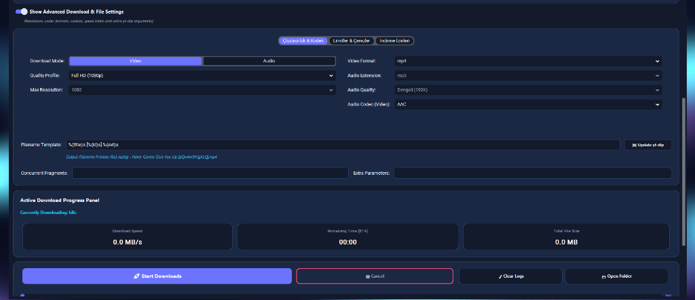
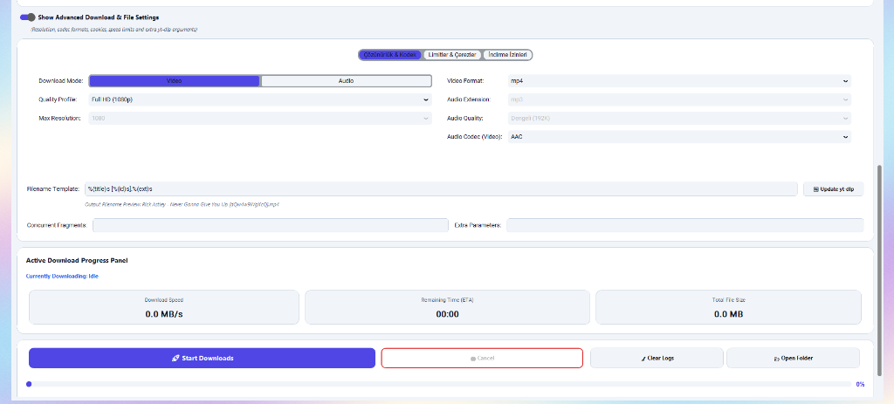
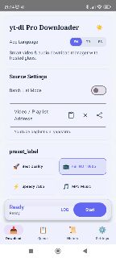

<div align="center">

# ⬇️ yt-dlp Downloader Pro

**A zero-config, glassmorphic media downloader for Windows & Android**
powered by yt-dlp + ffmpeg — download videos, music and playlists from YouTube and 1000+ sites in seconds.

[](LICENSE)
[](https://github.com/BayNuman/yt-dlp-downloader-pro/releases)
[](https://github.com/BayNuman/yt-dlp-downloader-pro/releases)
[](https://github.com/BayNuman/yt-dlp-downloader-pro/actions/workflows/android-ci.yml)
[](https://github.com/BayNuman/yt-dlp-downloader-pro/releases)
[](https://github.com/BayNuman/yt-dlp-downloader-pro/stargazers)

[🚀 Direct Download Setup (Windows)](https://github.com/BayNuman/yt-dlp-downloader-pro/releases/latest/download/yt-dlp_Downloader_Pro_Setup.exe) · [📱 Direct Download APK (Android)](https://github.com/BayNuman/yt-dlp-downloader-pro/releases/latest/download/app-debug.apk) · [🐛 Report Bug](https://github.com/BayNuman/yt-dlp-downloader-pro/issues/new?template=bug_report.md) · [💡 Request Feature](https://github.com/BayNuman/yt-dlp-downloader-pro/issues/new?template=feature_request.md)

</div>

---

## 📥 Quick Download / Hızlı İndir (Zero-Config)

> 💡 **For non-technical users:** You do **NOT** need to install Python, ffmpeg, or use command-line/terminal. Everything is pre-bundled and works with a single click!
> 
> 💡 **Teknik olmayan kullanıcılar için:** Bilgisayarınıza veya telefonunuza ek bir program (Python, ffmpeg vb.) kurmanız gerekmez. Her şey paketlenmiştir, tek tıkla çalışır!

<div align="center">

| Platform | Package Type / Paket Türü | Direct Link / Doğrudan İndirme Linki |
| :--- | :--- | :--- |
| **🖥️ Windows** | **Installer / Kurulum (Recommended)** | [**📥 Download Setup (.exe)**](https://github.com/BayNuman/yt-dlp-downloader-pro/releases/latest/download/yt-dlp_Downloader_Pro_Setup.exe) |
| **🖥️ Windows** | **Portable / Taşınabilir (No Install)** | [**📥 Download Portable App (.exe)**](https://github.com/BayNuman/yt-dlp-downloader-pro/releases/latest/download/yt-dlp.Downloader.Pro.exe) |
| **📱 Android** | **APK / Mobil Uygulama** | [**📥 Download Mobile App (.apk)**](https://github.com/BayNuman/yt-dlp-downloader-pro/releases/latest/download/app-debug.apk) |

</div>

---

## ✨ What Is This?

**yt-dlp Downloader Pro** is a beautiful, fully-featured media downloader available on both **Windows desktop** and **Android**. Unlike command-line tools, it gives you:

- 🎨 A modern glassmorphic UI — dark mode, smooth animations
- 🌍 Multi-language support (English, Turkish, Spanish)
- 📋 Download queue with real-time progress
- 📁 Download history with re-download option
- ⚙️ Quality presets for video and audio
- 🔒 No account, no ads, no tracking — 100% local

Supports **YouTube, Vimeo, SoundCloud, Twitter/X, Instagram, TikTok** and [1000+ more sites](https://github.com/yt-dlp/yt-dlp/blob/master/supportedsites.md).

---

## 🚀 Quick Start

### 🖥️ Windows Desktop — 3 Steps

```
1. Download  →  yt-dlp_Downloader_Pro_Setup.exe  from Releases
2. Install   →  Double-click → Next → Install (takes ~30 seconds)
3. Use       →  Launch from Desktop shortcut, paste any URL, click Download
```

> **No Python, no ffmpeg, no terminal needed.** Everything is bundled.

### 📱 Android — 3 Steps

```
1. Download  →  app-debug.apk  from Releases
2. Install   →  Allow "Install from unknown sources" when prompted
3. Use       →  Open app, grant storage permission, paste URL or share from browser
```

> **Minimum Android 8.0 (API 26).** Works on all Android phones and tablets.

---

## 📸 Screenshots

### 🖥️ Desktop — Dark Mode

<div align="center">
 
</div>

### 🖥️ Desktop — Light Mode

<div align="center">
 
</div>

### 📱 Android

<div align="center">



</div>


---

## 🎯 Features

### 🖥️ Desktop (Windows)

| Feature | Details |
|---------|---------|
| 🎨 Glassmorphic UI | Dark & Light themes with smooth animations |
| 📹 Video Quality | Best, 1080p, 720p, 480p, 360p |
| 🎵 Audio Formats | MP3, AAC, OPUS, FLAC, WAV |
| 📋 Download Queue | Batch downloads with per-item progress bars |
| 📁 History | Persistent history, re-download with one click |
| 🌍 Languages | English, Turkish, Spanish |
| 📦 Self-contained | ffmpeg bundled, no external dependencies |
| 🔧 Installer | Professional Windows installer via Inno Setup |

### 📱 Android (Kotlin + Jetpack Compose)

| Feature | Details |
|---------|---------|
| 🧭 Navigation | 4-tab bottom nav: Download, Queue, History, Settings |
| ⚙️ Background Service | Foreground download service — continues in background |
| 🔗 Share Intent | Share any URL directly from Chrome, Firefox, YouTube app |
| 🔔 Permissions | Automatic onboarding at startup (storage + notifications) |
| 🌍 Languages | English, Turkish, Spanish |
| 🎨 Design | Material 3 glassmorphic dark theme |
| 📱 Compatibility | Android 8.0+ (API 26), ARM64 + x86_64 |

---

## 📦 Installation

### Windows — Installer (Recommended)

1. Go to [Releases](https://github.com/BayNuman/yt-dlp-downloader-pro/releases/latest)
2. Download `yt-dlp_Downloader_Pro_Setup.exe`
3. Run the installer and follow on-screen instructions
4. Launch **yt-dlp Downloader Pro** from your Desktop or Start Menu

### Windows — Portable (No Install)

1. Download `yt-dlp Downloader Pro.exe` from [Releases](https://github.com/BayNuman/yt-dlp-downloader-pro/releases/latest)
2. Run directly — no installation needed

### Android — APK Sideload

1. Download `app-debug.apk` from [Releases](https://github.com/BayNuman/yt-dlp-downloader-pro/releases/latest)
2. On your Android device: **Settings → Apps → Special App Access → Install Unknown Apps**
3. Allow your browser or file manager to install APKs
4. Tap the downloaded APK to install

---

## 🛠️ Building from Source

### Prerequisites — Desktop

- Python 3.10 or newer
- pip
- [Inno Setup 6](https://jrsoftware.org/isinfo.php) (for building the installer)

```bash
# Clone
git clone https://github.com/BayNuman/yt-dlp-downloader-pro.git
cd yt-dlp-downloader-pro

# Install dependencies
pip install customtkinter yt-dlp pillow requests pyinstaller

# Run the app
python app.py

# Build standalone .exe + installer
python build_full_distribution.py
```

The build script automatically:
1. Downloads `ffmpeg.exe` and `ffprobe.exe`
2. Bundles everything with PyInstaller
3. Compiles the professional Inno Setup installer

### Prerequisites — Android

- Android Studio Hedgehog (2023.1.1) or newer
- JDK 17+
- Android SDK with API level 26+

```bash
# Clone
git clone https://github.com/BayNuman/yt-dlp-downloader-pro.git
cd yt-dlp-downloader-pro/android

# Build debug APK
./gradlew assembleDebug

# Install on connected device
./gradlew installDebug
```

The APK will be in: `android/app/build/outputs/apk/debug/app-debug.apk`

---

## 🏗️ Architecture

```
yt-dlp-downloader-pro/
│
├── 🖥️ Desktop (Python + CustomTkinter)
│   ├── app.py                       # Main entry point & UI
│   ├── build_desktop.py             # PyInstaller build script
│   ├── build_full_distribution.py   # Full distribution builder
│   └── installer.iss                # Inno Setup configuration
│
└── 📱 Android (Kotlin + Jetpack Compose)
    └── android/
        └── app/src/main/
            ├── java/com/baynuman/ytdownloader/
            │   ├── MainActivity.kt           # App entry + permissions
            │   ├── DownloadService.kt        # Foreground download service
            │   └── ui/
            │       ├── DownloaderScreen.kt   # Main UI (4 tabs)
            │       ├── DownloaderViewModel.kt # State management
            │       └── theme/
            │           └── Translations.kt   # i18n strings (EN/TR/ES)
            └── res/
                └── xml/file_paths.xml        # FileProvider paths
```

---

## 🌍 Supported Sites

This app uses [yt-dlp](https://github.com/yt-dlp/yt-dlp) under the hood, which supports **1000+ websites** including:

YouTube • YouTube Music • Vimeo • SoundCloud • Twitter/X • Instagram • TikTok • Facebook • Dailymotion • Twitch • Reddit • Bandcamp • Mixcloud • and many more...

[→ Full list of supported sites](https://github.com/yt-dlp/yt-dlp/blob/master/supportedsites.md)

---

## 🤝 Contributing

Contributions are welcome! Whether it's a bug fix, new language, or feature idea:

1. Read the [Contributing Guide](CONTRIBUTING.md)
2. Check [open issues](https://github.com/BayNuman/yt-dlp-downloader-pro/issues)
3. Fork, branch, and submit a Pull Request

---

## 📋 Roadmap

- [ ] macOS desktop support
- [ ] iOS companion app
- [ ] Subtitle download support
- [ ] Browser extension (Chrome/Firefox)
- [ ] Dark/Light theme toggle on Android
- [ ] Playlist management with selective download

Have an idea? [Open a feature request!](https://github.com/BayNuman/yt-dlp-downloader-pro/issues/new?template=feature_request.md)

---

## ⚖️ Legal Notice

This software is a **GUI wrapper** around [yt-dlp](https://github.com/yt-dlp/yt-dlp). Users are responsible for complying with the Terms of Service of any platform they download content from. Only download content you have the right to access.

---

## 📄 License

Distributed under the **MIT License**. See [LICENSE](LICENSE) for details.

---

<div align="center">

Made with ❤️ by [BayNuman](https://github.com/BayNuman)

If this project helped you, please consider giving it a ⭐ — it helps others find it!

</div>
