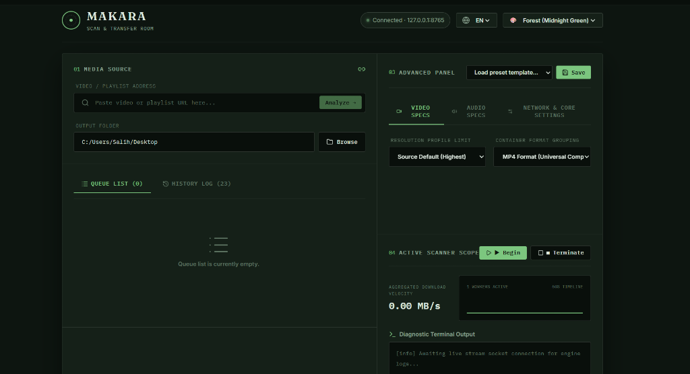
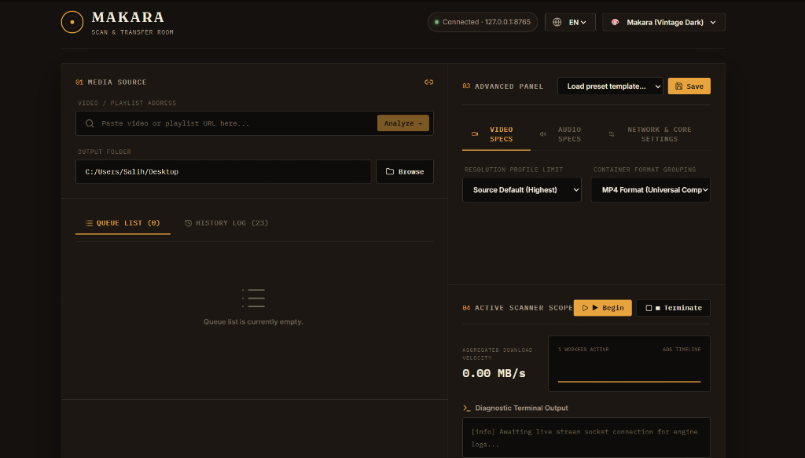
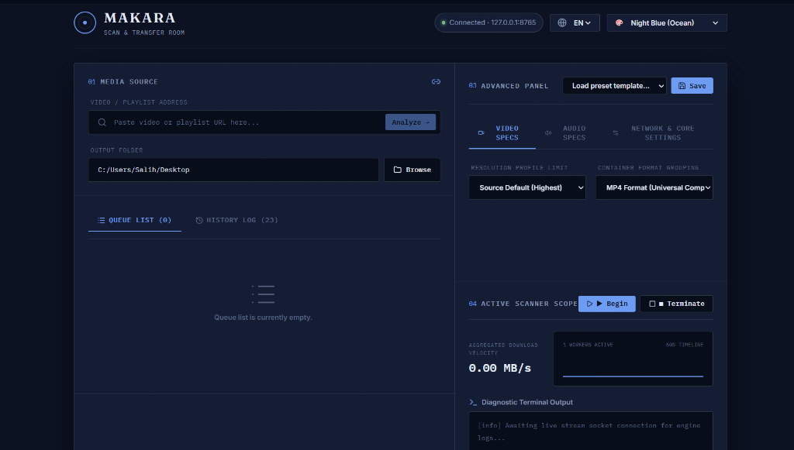

# yt-dlp Downloader Pro

<p align="center">
  <a href="README.md">🇺🇸 English</a> &nbsp;·&nbsp;
  <b>🇹🇷 Türkçe</b> &nbsp;·&nbsp;
  <a href="README.es.md">🇪🇸 Español</a>
</p>

[](LICENSE)
[](https://github.com/BayNuman/yt-dlp-downloader-pro/releases)
[](https://github.com/BayNuman/yt-dlp-downloader-pro/releases)
[](https://github.com/BayNuman/yt-dlp-downloader-pro/actions/workflows/android-ci.yml)
[](https://github.com/BayNuman/yt-dlp-downloader-pro/stargazers)

> **Rust Tauri**, **React/Vite** ve gömülü **FastAPI (Python)** arka uç mimarisiyle geliştirilmiş, cam derinlikli (glassmorphic) şık arayüze sahip premium video ve ses indirme yöneticisi. Spotify çalma listesi çözümlenmesi ve toplu indirilmesi, SponsorBlock ve video bölümleri üst katmanlı etkileşimli zaman kırpma slider'ı, özel renk temaları ve bağımsız kurulum paketleri sunar.

---

## 📥 Hızlı İndirme Linkleri

| Platform | Format | Yayın Paketi |
| :--- | :--- | :--- |
| **🖥️ Windows** | Kurulumcu (Önerilen) | [📥 Setup.exe İndir (v2.0.0)](https://github.com/BayNuman/yt-dlp-downloader-pro/releases/latest/download/yt-dlp-downloader-pro-v2.0.0-setup.exe) |
| **🖥️ Windows** | MSI Paketi | [📥 Package.msi İndir (v2.0.0)](https://github.com/BayNuman/yt-dlp-downloader-pro/releases/latest/download/yt-dlp-downloader-pro-v2.0.0.msi) |
| **📱 Android** | APK (Android 8.0+) | [📥 Uygulama APK İndir](https://github.com/BayNuman/yt-dlp-downloader-pro/releases/latest/download/app-release.apk) |

---

## 🚀 Öne Çıkan Özellikler

| Özellik | Diğer İndiriciler | yt-dlp Downloader Pro |
| :--- | :--- | :--- |
| **Spotify Playlist İndirme** | ❌ (Spotify linklerini çözemez) | ✅ Spotify API ile şarkıları otomatik çözer ve YouTube'dan indirir |
| **Etkileşimli Zaman Kırpma** | ❌ (Yalnızca tam video) | ✅ SponsorBlock ve Bölüm katmanlı çift tutamaçlı slider |
| **Masaüstü Mimarisi** | 🐢 Yavaş Python GUI sarmalayıcıları | ⚡ Gömülü FastAPI servisli ultra hızlı Rust Tauri penceresi |
| **Tema Özelleştirme** | ❌ Sabit temalar | ✅ Çoklu vintage ve modern cam derinlikli temalar (Forest, Makara, Night Blue vb.) |
| **SponsorBlock Entegrasyonu** | ❌ | ✅ Reklam ve sponsor bölümlerini otomatik atlar ve keser |
| **403 Hata Bypass** | ❌ | ✅ TV İstemcisi yedek imza mekanizması |
| **Paralel Kuyruk Yöneticisi** | ❌ | ✅ Thread-safe çoklu iş parçacıklı eş zamanlı indirme kuyruğu |

---

## 📸 Masaüstü Ekran Görüntüleri

<table align="center">
<tr>
<td align="center"></td>
<td align="center"></td>
</tr>
<tr>
<td align="center"><em>Forest (Midnight Green) Teması</em></td>
<td align="center"><em>Makara (Vintage Dark) Teması</em></td>
</tr>
<tr>
<td align="center" colspan="2"></td>
</tr>
<tr>
<td align="center" colspan="2"><em>Night Blue (Ocean) Teması</em></td>
</tr>
</table>

---

## 📱 Android Ekran Görüntüleri

<table>
<tr>
<td></td>
<td></td>
<td></td>
<td></td>
</tr>
<tr>
<td align="center"><em>İndirme Ekranı</em></td>
<td align="center"><em>İndirme Kuyruğu</em></td>
<td align="center"><em>Geçmiş</em></td>
<td align="center"><em>Ayarlar</em></td>
</tr>
</table>

---

## 📦 Kurulum ve Çalıştırma

### 🖥️ Windows Kurulumu
1. **[yt-dlp-downloader-pro-v2.0.0-setup.exe](https://github.com/BayNuman/yt-dlp-downloader-pro/releases/latest/download/yt-dlp-downloader-pro-v2.0.0-setup.exe)** dosyasını indirin.
2. Kurulum programını çift tıklayıp sihirbazı tamamlayın (~20 saniye).
3. Paket tamamen bağımsızdır; Python arka uç servisi, FFmpeg ve FFprobe içine gömülüdür.

### 📱 Android Kurulumu
1. **[app-release.apk](https://github.com/BayNuman/yt-dlp-downloader-pro/releases/latest/download/app-release.apk)** dosyasını telefonunuza indirin.
2. Güvenlik ayarlarında **Bilinmeyen Kaynaklardan Yükleme** iznini verin.
3. APK dosyasını açıp **Yükle** butonuna dokunun.

---

## 🛠️ Kaynak Koddan Derleme

### Gereksinimler
- **Node.js** (v18+) ve **npm**
- **Rust** ve **Cargo** (son kararlı sürüm)
- **Python** (v3.10+)

### Masaüstü Derleme (Tauri + FastAPI)
1. **Depoyu klonlayın:**
   ```bash
   git clone https://github.com/BayNuman/yt-dlp-downloader-pro.git
   cd yt-dlp-downloader-pro
   ```
2. **Python sanal ortamı ve bağımlılıklarını kurun:**
   ```bash
   python -m venv .venv
   .venv\Scripts\activate
   pip install -r requirements.txt
   ```
3. **Python Arka Uç Servisini Derleyin:**
   ```bash
   python build_sidecar.py
   ```
4. **Ön Yüz Bağımlılıklarını Yükleyin ve Geliştirici Modunu Başlatın:**
   ```bash
   cd frontend
   npm install
   npx @tauri-apps/cli dev
   ```
5. **Kurulum Paketini Üretin (`.exe` / `.msi`):**
   ```bash
   npx @tauri-apps/cli build
   ```

---

## 🏗️ Proje Mimarisi

```text
yt-dlp-downloader-pro/
│
├── 🖥️ Masaüstü Ön Yüz (React + TypeScript + Vite + Tailwind CSS)
│   ├── src/
│   │   ├── components/      # Cam görünüm paneller (Url, Preview, Queue, Progress, Advanced)
│   │   ├── store/           # Zustand ile global durum yönetimi
│   │   ├── hooks/           # Canlı WebSocket akış hook'u
│   │   └── i18n/            # Çoklu dil desteği (EN, TR, ES)
│   └── src-tauri/           # Rust Tauri Penceresi & Sidecar Süreç Yöneticisi
│
├── ⚙️ Masaüstü Arka Yüz (FastAPI + Python 3.13)
│   ├── server/              # REST ve WebSocket API uç noktaları
│   ├── core/                # Görev yöneticisi, yt-dlp motoru, FFmpeg ve SponsorBlock
│   └── build_sidecar.py     # PyInstaller bağımsız sidecar derleyicisi
│
└── 📱 Mobil Uygulama (Android - Kotlin + Jetpack Compose)
    └── android/             # Ön plan servisi ve yt-dlp çalıştırıcılı Android uygulaması
```

---

## 🌍 Desteklenen Platformlar

`yt-dlp` altyapısı sayesinde **1000'den fazla video ve müzik platformu** desteklenmektedir:

YouTube • Spotify (YouTube araması üzerinden) • YouTube Music • Vimeo • SoundCloud • Twitter/X • Instagram • TikTok • Facebook • Dailymotion • Twitch • Reddit • Bandcamp • ve daha fazlası...

---

## 🗺️ Yol Haritası

- [ ] macOS masaüstü desteği
- [ ] Android zaman aralığı kırpma paneli (slider + dönüştürme profilleri)
- [ ] Tarayıcı eklentisi (tek tıkla entegrasyon)
- [ ] Zamanlanmış indirmeler (belirli bir saate kurma sayacı)
- [ ] Plex / Jellyfin medya kütüphanesi otomatik etiketleme entegrasyonu
- [ ] Küçük resim kare şerit (filmstrip) slider'ı

---

## 🤝 Katkıda Bulunma

Katkılarınızı bekliyoruz!
1. [Katkı Kılavuzumuzu](CONTRIBUTING.md) inceleyin.
2. Depoyu forklayın, yeni bir özellik dalı açın ve Pull Request gönderin.

---

## ⚖️ Yasal Uyarı

Bu yazılım [yt-dlp](https://github.com/yt-dlp/yt-dlp) için geliştirilmiş bir GUI arayüz istemcisidir. Kullanıcılar, indirme yaptıkları platformların hizmet şartlarına uymaktan tamamen kendileri sorumludur.

---

## 📄 Lisans

MIT Lisansı ile dağıtılmaktadır. Detaylar için [LICENSE](LICENSE) dosyasına göz atabilirsiniz.

---

## 💡 Yapılması ve Kaçınılması Gerekenler (Dos & Don'ts)

| Yapılması Gerekenler | Kaçınılması Gerekenler |
| :--- | :--- |
| **Göreceli yollar kullanın** (repo içi `./assets/...` gibi) resimler ve kısayollar için. | **Mutlak yollar kullanmaktan kaçının** (`C:/Users/isim/...` gibi yollar diğer geliştiricilerde çalışmaz). |
| **Kod bloklarında dili tam belirtin** (örneğin ` ```bash `, ` ```python `) böylece kod renklendirmesi düzgün çalışır. | **Dili belirtilmemiş** veya boş bırakılmış ` ``` ` blokları kullanmayın. |
| **Tablolar ve emojiler kullanın** metinleri bölmek ve bilişsel yükü en aza indirmek için. | **Düz yazılardan oluşan devasa metin blokları yazmayın**; bu okuma yorgunluğu yaratır. |
| **Kurulum talimatlarını güncel tutun** ve yayınlamadan önce komutları yerel terminalde test edin. | **Eski veya eksik bağımlılık talimatları bırakmayın**, bu durum Geliştirici Deneyimini (DX) olumsuz etkiler. |

---

<div align="center">

[BayNuman](https://github.com/BayNuman) tarafından ❤️ ile yapılmıştır

[**🧡 Patreon'da Destek Olun**](https://patreon.com/BayNuman?utm_medium=unknown&utm_source=join_link&utm_campaign=creatorshare_creator&utm_content=copyLink)

Bu projeyi yararlı bulduysanız, diğer geliştiricilerin de keşfetmesi için bir ⭐ vermeyi unutmayın!

</div>
