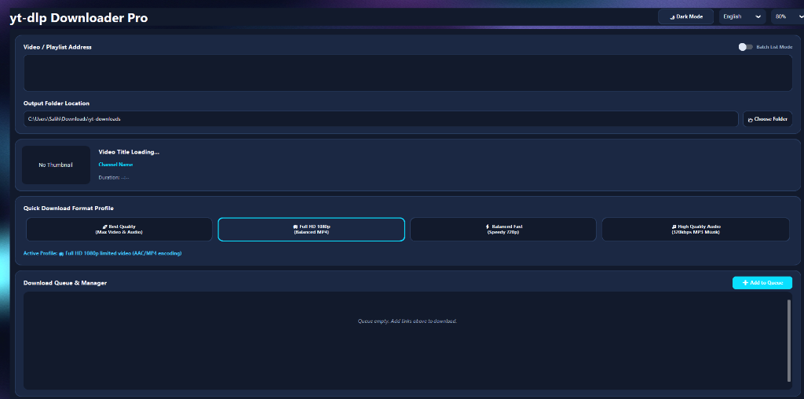
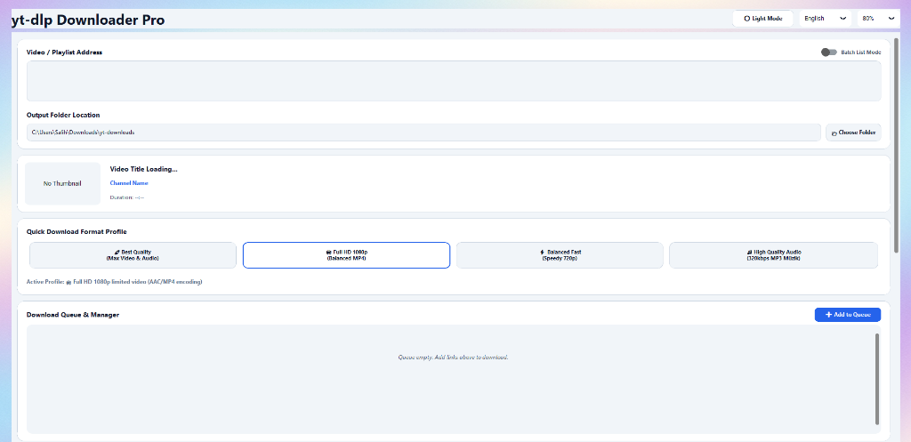
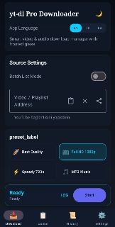
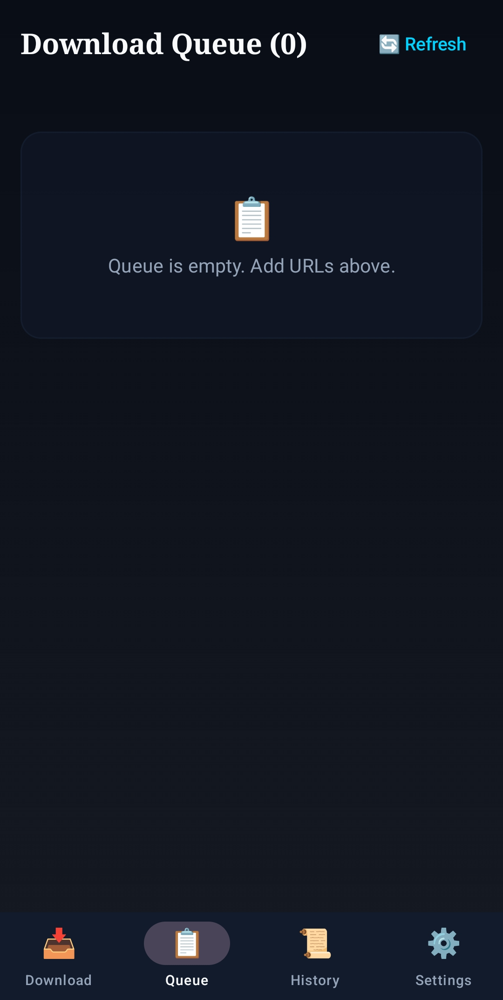
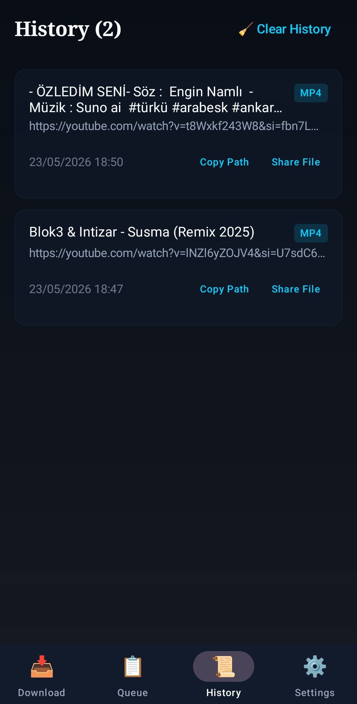
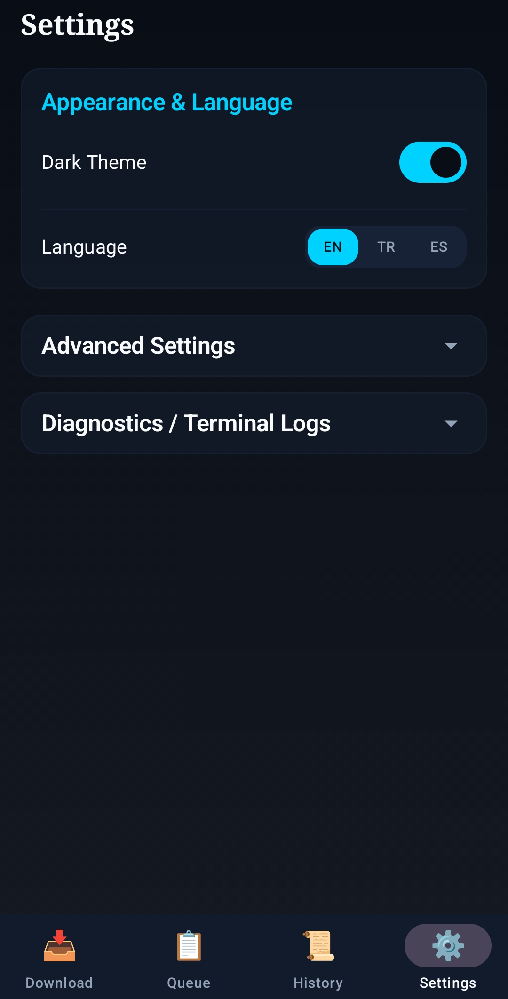

<div align="center">


# yt-dlp Downloader Pro

**Tek tıkla video ve müzik indirme — Windows & Android**

<p align="center">
  <a href="README.md">🇺🇸 English</a> &nbsp;·&nbsp;
  <b>🇹🇷 Türkçe</b> &nbsp;·&nbsp;
  <a href="README.es.md">🇪🇸 Español</a>
</p>

YouTube, Vimeo, SoundCloud ve 1000+ siteden video, müzik ve playlist indirin.  
Kırpma, dönüştürme, kuyruk yönetimi — hepsi tek uygulamada.

[](LICENSE)
[](https://github.com/BayNuman/yt-dlp-downloader-pro/releases)
[](https://github.com/BayNuman/yt-dlp-downloader-pro/releases)
[](https://github.com/BayNuman/yt-dlp-downloader-pro/actions/workflows/android-ci.yml)
[](https://github.com/BayNuman/yt-dlp-downloader-pro/stargazers)
[](https://patreon.com/BayNuman?utm_medium=unknown&utm_source=join_link&utm_campaign=creatorshare_creator&utm_content=copyLink)

[**⬇️ Windows İndir**](https://github.com/BayNuman/yt-dlp-downloader-pro/releases/latest/download/yt-dlp_Downloader_Pro_Setup.exe) &nbsp;·&nbsp;
[**📱 Android APK**](https://github.com/BayNuman/yt-dlp-downloader-pro/releases/latest/download/app-release.apk) &nbsp;·&nbsp;
[**🐛 Hata Bildir**](https://github.com/BayNuman/yt-dlp-downloader-pro/issues/new?template=bug_report.md) &nbsp;·&nbsp;
[**💡 Özellik İste**](https://github.com/BayNuman/yt-dlp-downloader-pro/issues/new?template=feature_request.md) &nbsp;·&nbsp;
[**🧡 Patreon'da Destek Olun**](https://patreon.com/BayNuman?utm_medium=unknown&utm_source=join_link&utm_campaign=creatorshare_creator&utm_content=copyLink)

</div>

---

## ✨ Rakiplerden Farkı Ne?

Piyasada onlarca yt-dlp arayüzü var. Bu proje farklı çünkü:

| Özellik | Diğer GUI'ler | Bu Uygulama |
|---|---|---|
| Zaman aralığı kırpma (clip) | ❌ | ✅ Çift tutamaçlı slider |
| Chapter desteği | ❌ | ✅ Tıkla, otomatik doldur |
| Aynı videodan çoklu klip | ❌ | ✅ Greedy interval merging |
| Instagram Reels / Shorts export | ❌ | ✅ 9:16 otomatik kırpma |
| Discord/WhatsApp boyut sınırı | ❌ | ✅ Bitrate otomatik hesaplanır |
| YouTube 403 otomatik fallback | ❌ | ✅ TV Client retry |
| Akıllı format önerisi | ❌ | ✅ Metadata analizi |
| Paralel indirme | ❌ çoğunda | ✅ ThreadPoolExecutor |

---

## ⬇️ Kurulum

> Python, ffmpeg veya terminal kurmanıza gerek yok. Her şey paketlenmiş halde gelir.

| Platform | Paket | İndir |
|---|---|---|
| 🖥️ Windows | Kurulum (.exe) — Önerilen | [📥 Setup İndir](https://github.com/BayNuman/yt-dlp-downloader-pro/releases/latest/download/yt-dlp_Downloader_Pro_Setup.exe) |
| 🖥️ Windows | Taşınabilir (.exe) — Kurulumsuz | [📥 Portable İndir](https://github.com/BayNuman/yt-dlp-downloader-pro/releases/latest/download/yt-dlp.Downloader.Pro.exe) |
| 📱 Android | APK (Android 8.0+) | [📥 APK İndir](https://github.com/BayNuman/yt-dlp-downloader-pro/releases/latest/download/app-release.apk) |

**Windows'ta SmartScreen uyarısı alırsanız:** "Daha fazla bilgi" → "Yine de çalıştır" seçin. Uygulama açık kaynaktır, kod güvenliğini kendiniz inceleyebilirsiniz.

**Android'de kurulum:** Ayarlar → Uygulamalar → Bilinmeyen kaynaklardan yüklemeye izin ver → APK'ya tıkla.

---

## 📸 Ekran Görüntüleri

<table>
<tr>
<td></td>
<td></td>
</tr>
<tr>
<td align="center"><em>Windows — Koyu Tema</em></td>
<td align="center"><em>Windows — Açık Tema</em></td>
</tr>
</table>

<table>
<tr>
<td></td>
<td></td>
<td></td>
<td></td>
</tr>
<tr>
<td align="center"><em>İndir</em></td>
<td align="center"><em>Kuyruk</em></td>
<td align="center"><em>Geçmiş</em></td>
<td align="center"><em>Ayarlar</em></td>
</tr>
</table>

---

## 🎯 Özellikler

### ✂️ Clip Engine — Rakiplerde Yok

Videodun sadece istediğiniz bölümünü indirin. 30 dakikalık bir videodan 30 saniyelik kısmı saniyeler içinde alın.

- **Çift tutamaçlı slider** — başlangıç ve bitiş noktalarını sürükleyerek seçin
- **Chapter desteği** — video bölümlerine tıklamak başlangıç/bitiş süresini otomatik doldurur
- **Aynı videodan çoklu klip** — bir URL'den birden fazla zaman aralığı seçin, tek seferde indirin
- **Hassas / Hızlı kesim** — keyframe snap (hızlı) veya milisaniye hassasiyeti (yeniden kodlama)
- **Hibrit strateji** — videonun %15'inden azı isteniyorsa stream seek, büyük parçalarda buffered download + lokal trim

### 🎨 Export Profilleri

| Profil | Çıktı |
|---|---|
| Instagram Reels (max 90s) | 9:16 merkezi kırpma, MP4 |
| YouTube Shorts (max 60s) | 9:16 merkezi kırpma, MP4 |
| Discord (max 25MB) | Otomatik bitrate hesabı |
| WhatsApp (max 16MB) | Otomatik bitrate hesabı |
| GIF Oluşturucu | 15fps, 480px, palette optimizasyonu |
| Sesli Not / Sesli Kitap | Mono, 48kbps, M4A |

### 📋 İndirme Yönetimi

- Paralel indirme kuyruğu (ThreadPoolExecutor, max_workers ayarlanabilir)
- Kalıcı indirme geçmişi (SQLite) — tek tıkla tekrar indir
- Özel şablon kaydetme (Podcast MP3, 4K Arşiv vb.)
- Playlist aralığı, hız limiti, eşzamanlı parça sayısı

### 🔧 Gelişmiş

- SponsorBlock — sponsor segmentlerini otomatik kes
- Çerez desteği — özel .txt dosyası veya tarayıcıdan (Chrome, Edge, Firefox...)
- YouTube 403 otomatik TV Client fallback
- Metadata, thumbnail, altyazı indirme
- Akıllı format önerisi — müzik mi, podcast mi, dikey video mu otomatik tahmin eder
- Ek yt-dlp parametresi alanı — tam esneklik

### 🌍 Platform

| Özellik | Windows | Android |
|---|---|---|
| Koyu / Açık tema | ✅ | ✅ |
| Türkçe / İngilizce / İspanyolca | ✅ | ✅ |
| Arka planda indirme | ✅ | ✅ ForegroundService |
| Paylaş menüsünden URL alma | — | ✅ Share Intent |
| Bildirim | ✅ Toast | ✅ Notification |

---

## 🚀 Hızlı Başlangıç

### Windows

```
1. yt-dlp_Downloader_Pro_Setup.exe dosyasını indirin
2. Çift tıklayın, "İleri" → "Kur" (yaklaşık 30 saniye)
3. Masaüstü kısayolundan açın, URL yapıştırın, İndir'e basın
```

### Android

```
1. app-release.apk dosyasını telefonunuza indirin
2. "Bilinmeyen kaynaktan yükle" iznini verin
3. APK'ya dokunun, izinleri onaylayın, kullanmaya başlayın
```

---

## 🛠️ Kaynaktan Derleme

### Gereksinimler (Windows)

- Python 3.10+
- Inno Setup 6 (installer için)

```bash
git clone https://github.com/BayNuman/yt-dlp-downloader-pro.git
cd yt-dlp-downloader-pro

pip install customtkinter yt-dlp pillow requests pyinstaller tkinterdnd2

# Uygulamayı çalıştır
python app.py

# Standalone .exe + installer derle
python build_full_distribution.py
```

Build scripti otomatik olarak ffmpeg.exe ve ffprobe.exe'yi indirir, PyInstaller ile paketler ve Inno Setup installer oluşturur.

### Gereksinimler (Android)

- Android Studio Hedgehog (2023.1.1)+
- JDK 17+
- Android SDK API 26+

```bash
cd android
./gradlew assembleRelease
# Çıktı: android/app/build/outputs/apk/release/app-release.apk
```

---

## 🏗️ Mimari

```
yt-dlp-downloader-pro/
│
├── 🖥️  Desktop (Python + CustomTkinter)
│   ├── app.py                    # Bootstrap — sadece main()
│   ├── core/
│   │   ├── app_state.py          # Merkezi durum (AppState, DownloadTask, TaskStatus enum)
│   │   ├── command_builder.py    # Pure function — yt-dlp argüman üreteci
│   │   ├── downloader.py         # ThreadPoolExecutor kuyruk yöneticisi
│   │   ├── clip.py               # Greedy interval merge + hibrit strateji motoru
│   │   ├── merger.py             # FFmpeg Concat Demuxer
│   │   ├── profiles.py           # Polymorphic export profilleri
│   │   ├── suggester.py          # Heuristik format öneri motoru
│   │   ├── history.py            # SQLite + thread-safe DatabaseWriter
│   │   ├── presets.py            # JSON preset kaydet/yükle
│   │   ├── updater.py            # PyPI versiyon kontrolü (arka planda)
│   │   └── env.py                # Windows registry PATH yenileyici
│   └── ui/
│       ├── theme.py              # Glassmorphic tema + TR/EN/ES çeviriler
│       ├── main_window.py        # Ana pencere + metadata fetch
│       └── panels/               # Bağımsız panel bileşenleri
│
└── 📱  Android (Kotlin + Jetpack Compose)
    └── android/app/src/main/
        ├── MainActivity.kt
        ├── DownloadService.kt    # ForegroundService
        └── ui/
            ├── DownloaderScreen.kt
            ├── DownloaderViewModel.kt
            └── theme/Translations.kt
```

**Temel tasarım kararları:**
- `core/` katmanı UI'dan tamamen bağımsız — Android'e taşınabilir
- `command_builder.py` pure function — `self` gerektirmez, unit test edilebilir
- `DatabaseWriter` singleton — tüm thread'ler non-blocking queue üzerinden yazar
- `--load-info-json` optimizasyonu — metadata bir kere çekilir, indirmede tekrar ağa gidilmez

---

## 🌍 Desteklenen Siteler

yt-dlp motoru sayesinde **1000+ site** desteklenir:

YouTube • YouTube Music • Vimeo • SoundCloud • Twitter/X • Instagram • TikTok • Facebook • Dailymotion • Twitch • Reddit • Bandcamp • ve daha fazlası...

→ [Tam site listesi](https://github.com/yt-dlp/yt-dlp/blob/master/supportedsites.md)

---

## 🗺️ Yol Haritası

- [ ] macOS masaüstü desteği
- [ ] Android clip engine (slider + export profilleri)
- [ ] Tarayıcı eklentisi (Chrome/Firefox)
- [ ] Zamanlanmış indirme (gece 02:00'de indir)
- [ ] Plex / Jellyfin media server entegrasyonu
- [ ] Thumbnail filmstrip slider

Fikriniz mi var? [Özellik isteği açın!](https://github.com/BayNuman/yt-dlp-downloader-pro/issues/new?template=feature_request.md)

---

## 🤝 Katkı

Katkılar memnuniyetle karşılanır — hata düzeltmesi, yeni dil veya özellik fikri.

1. [Katkı Kılavuzu](CONTRIBUTING.md)'nu okuyun
2. [Açık issue'ları](https://github.com/BayNuman/yt-dlp-downloader-pro/issues) inceleyin
3. Fork alın, branch açın, Pull Request gönderin

---

## ⚖️ Yasal Uyarı

Bu yazılım [yt-dlp](https://github.com/yt-dlp/yt-dlp) için bir GUI arayüzüdür. Kullanıcılar, içerik indirdikleri platformların Kullanım Şartlarına uymakla sorumludur. Yalnızca erişim hakkınız olan içerikleri indirin.

---

## 📄 Lisans

MIT Lisansı ile dağıtılır. Detaylar için [LICENSE](LICENSE) dosyasına bakın.

---

<div align="center">

Made with ❤️ by [BayNuman](https://github.com/BayNuman)

[**🧡 Patreon'da Destekçi Olun**](https://patreon.com/BayNuman?utm_medium=unknown&utm_source=join_link&utm_campaign=creatorshare_creator&utm_content=copyLink)

Bu proje işinize yaradıysa ⭐ vermeyi unutmayın — başkalarının bulmasına yardımcı olur!

</div>
